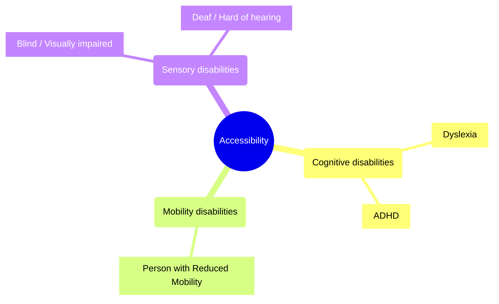

## Awesome Accessibility

Welcome to the Awesome Accessibility repository, a dedicated space where developers, designers, and advocates of digital accessibility can find and contribute to a collection of resources aimed at making mobile applications inclusive for all users.

